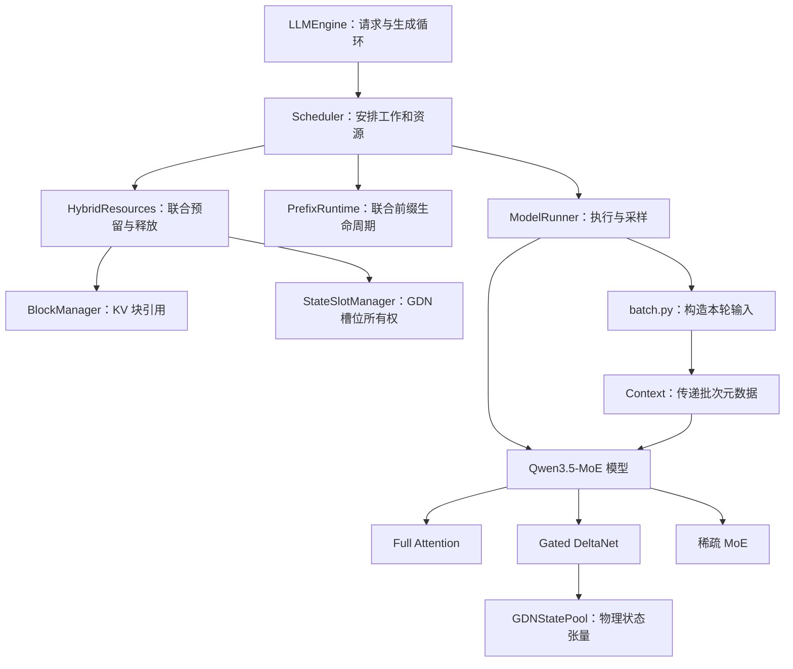

# 模型与运行时架构

[文档导航](README.md) · 上一章：[快速开始](00_quickstart.md) · 下一章：[调度与混合状态](02_scheduler_cache.md)

本章先解释模型计算，再解释运行时怎样携带历史状态。阅读时始终区分三个量：请求已经拥有的 token、已经计算进状态的 token、本轮准备计算的 token。

## 1. 一个 decoder 层做什么

[Qwen3_5MoeDecoderLayer](../nanovllm/models/qwen3_5_moe.py)按 `config.layer_types[layer_idx]` 选择序列算子，每层使用 GDN 或 Full Attention 之一，然后执行 MoE：

```text
输入 hidden states
  → RMSNorm
  → Gated DeltaNet 或 Full Attention
  → 加回残差
  → RMSNorm
  → 稀疏路由专家 + 带门控的共享专家
  → 加回残差
  → 下一层
```

层的排列来自模型配置，文档不假定固定间隔。整个模型在 decoder 层之前做 embedding，在最后做 RMSNorm；只有需要采样的位置才进入 `lm_head` 计算 logits。

### Full Attention：保留可寻址的历史 K/V

实现入口：[Qwen3_5MoeAttention](../nanovllm/models/qwen3_5_moe.py)、[Attention](../nanovllm/layers/attention.py)。

1. 从输入投影出 Q、K、V，以及输出门控值。
2. 对 Q/K 做模型规定的 RMSNorm，并对部分维度应用 RoPE。
3. 把新 K/V 写入对应的物理 KV 槽位。
4. 当前 Q 与有效历史 K/V 计算因果注意力。
5. 注意力输出乘以 `sigmoid(gate)`，再做输出投影。

这里的 Qwen3.5 RMSNorm 使用 `1 + weight` 作为缩放系数，不能与普通 `weight` 缩放的 RMSNorm 随意互换。GDN 内部的 `RMSNormGated` 另有自己的权重与 SiLU 门控语义。

Full Attention 的 KV 总量随上下文长度增长。分页只改变存储和寻址方式，并没有让每次 decode 不再读取历史。

### Gated DeltaNet：把历史压入固定状态

实现入口：[GatedDeltaNet](../nanovllm/layers/gated_delta_net.py)。

```text
输入投影
  → 拼接历史的因果逐通道卷积
  → 拆分 Q/K/V，归一化 Q/K
  → 逐 token 执行 delta-rule 更新
  → 带门控的 RMSNorm
  → 输出投影
```

每个活动请求在每个 GDN 层保存两类历史：

| 状态 | 保存的内容 | 活动状态 dtype |
| --- | --- | --- |
| `conv_state` | 因果卷积需要的近期投影输入 | 跟随模型 dtype |
| `recurrent_state` | delta-rule 累积的矩阵 | FP32 |

忽略批维度和头维度，把归一化后的 q/k 看成列向量，代码中的单步更新可写为：

```text
S_decay = exp(g_t) × S_previous
memory  = transpose(S_decay) × k_t
delta   = beta_t × (v_t - memory)
S_new   = S_decay + k_t × transpose(delta)
output  = transpose(S_new) × q_t
```

其中 `beta_t = sigmoid(b_t)`，`g_t = -exp(A_log) × softplus(a_t + dt_bias)`；q 在归一化后还乘以 `head_k_dim ** -0.5`。直观上，先衰减旧状态，再用当前 value 与旧记忆的差修正状态，最后读取输出。

单层循环矩阵的形状是 `[num_value_heads, key_head_dim, value_head_dim]`，不随序列长度增长。卷积状态也固定大小。不过本模型仍有 Full Attention 层，因此整个请求的显存并非与上下文长度无关。

当前实现按请求、按 token 执行 Python 循环，适合作为数值参考。调度层的“分块 prefill”表示分几轮执行输入，不表示这里已经使用了高性能分块 GDN kernel。

### 稀疏 MoE：只计算被选中的专家

实现入口：[Qwen3_5MoeTopKRouter / Qwen3_5MoeExperts / Qwen3_5MoeSparseMoeBlock](../nanovllm/models/qwen3_5_moe.py)。

每个 token 的路由过程是：

```text
router logits → FP32 softmax → Top-K → 对选中权重重新归一化
             → 各选中专家计算 → 按路由权重累加
             → 加上 sigmoid(shared_gate) × shared_expert
```

假设一个 token 的四个专家概率为 `[0.5, 0.3, 0.15, 0.05]`，选择 Top-2，则选中专家的混合权重为 `[0.625, 0.375]`。共享专家另行计算，不占这两个路由名额。

专家参数保持打包的三维张量；当前前向会找出本批次使用的专家，逐专家执行线性层，再用 `index_add_` 合并结果。它减少了每个 token 实际执行的专家数，但所有专家权重仍驻留显存。

## 2. 一个请求有两种物理历史

| 资源 | 管理对象 | 大小与共享方式 |
| --- | --- | --- |
| Full Attention KV | `BlockManager` | 按固定容量块增长，完整前缀块可共享并计数引用 |
| 活动 GDN 状态 | `StateSlotManager` + `GDNStatePool` | 每个请求独占一个逻辑槽位，各 GDN 层用相同槽号索引 |
| 可复用 GDN 快照 | `PrefixRuntime` + `JointPrefixCache` | 某个前缀边界处的 BF16 CPU 副本，与 KV 引用一起保存 |

核心约束是：**用于继续计算的 KV 历史和 GDN 状态必须表示同一段 token 前缀。** 稳定的已提交状态可以表示为：

```text
KV 的有效前缀长度 = GDN 的有效前缀长度 = Sequence.committed_tokens
```

这个等式描述有效历史，不表示物理缓冲区的总容量相同。执行中的状态可以暂时超过已提交边界；命中前缀后，GDN 也可以先以 `pending_state_snapshot` 形式等待恢复。运行时必须在下一次前向读取状态前完成恢复，并在执行成功后提交新边界。

## 3. Sequence 中最重要的字段

源码：[Sequence](../nanovllm/engine/sequence.py)。

| 字段 | 作用 |
| --- | --- |
| `token_ids` | 已知的输入与生成 token；`num_tokens` 和 `last_token` 由它直接取得 |
| `num_prompt_tokens` | 原始输入长度，用于区分 prompt 和 completion |
| `committed_tokens` | 两种历史共同表示的已提交长度 |
| `block_table` | 请求的逻辑块到物理 KV 块的映射 |
| `state_slot` | GDN 活动槽号，`-1` 表示尚未拥有槽位 |
| `pending_state_snapshot` | 命中前缀后，等待写入设备槽位的 GDN 快照 |

本轮安排由 [ScheduledChunk](../nanovllm/engine/schedule.py) 独立记录 `[start,end)`，执行成功后 `committed_tokens` 才推进到 `end`。

例如，长度为 3 的 prompt 完成 prefill 并生成第一个 token 后，`num_tokens=4`，但 `committed_tokens=3`。下一个 decode 会把第 4 个 token 送进模型，再生成第 5 个。这里的“少一个”是自回归生成的正常语义。

## 4. 运行时调用关系



图中的管理关系不代表每个节点都会逐个调用后续所有节点。实际执行顺序是：调度 → 必要的状态恢复 → 构造输入 → 模型 → 采样/快照 → 后处理提交。

| 文件 | 职责 |
| --- | --- |
| [llm_engine.py](../nanovllm/engine/llm_engine.py) | API、请求长度检查、生成循环、执行异常的恢复入口 |
| [scheduler.py](../nanovllm/engine/scheduler.py) | 队列、预算、资源预留、抢占与逻辑提交 |
| [schedule.py](../nanovllm/engine/schedule.py) | 保存本轮每个请求的执行区间和快照需求 |
| [hybrid_resources.py](../nanovllm/engine/hybrid_resources.py) | 联合预留、恢复与释放请求的 KV/GDN 资源 |
| [batch.py](../nanovllm/engine/batch.py) | 将本轮区间转成打包输入、位置和缓存索引 |
| [context.py](../nanovllm/utils/context.py) | 将单次 forward 的元数据传给模型层 |
| [cache_runtime.py](../nanovllm/engine/cache_runtime.py) | 分配物理 KV/GDN 张量，捕获和恢复快照 |
| [model_runner.py](../nanovllm/engine/model_runner.py) | 构造模型、加载、预热、前向与采样 |

`Context` 是当前批次的临时元数据，不拥有长期请求状态。`batch.py` 将它与输入张量一起返回；`ModelRunner.run()` 在作用域内安装上下文，退出作用域时恢复原值。

## 5. 变长打包到底打包了什么

假设本轮有两个已分配资源的请求：A 已提交 2 个 token，再计算 3 个；B 从头计算 2 个。

```text
input_ids         = [A2, A3, A4, B0, B1]   # 下标从 0 开始
positions         = [ 2,  3,  4,  0,  1]
q_offsets                = [0, 3, 5]
kv_lens                  = [5, 2]
paged_kv_indptr          = [0, 2, 3]      # 假设 page size = 4
paged_kv_indices         = [A0, A1, B0]   # 物理页号
paged_kv_last_page_len   = [1, 2]
state_prefix_lens        = [2, 0]
state_slots              = [A 的槽号, B 的槽号]
```

A 的 query 长度是 3，它能读取的 KV 长度是历史 2 加本轮 3，共 5；B 的 query/KV 长度均为 2。`paged_kv_indptr/indices/last_page_len` 用 CSR 形式描述每个请求实际占用的物理 KV 页。

必须保持下面的第 i 个请求对齐关系：

```text
q_offsets[i:i+2]
    ↔ paged_kv_indptr[i:i+2] 对应的物理页
    ↔ state_slots[i]
    ↔ state_prefix_lens[i]
```

ModelRunner 每个 batch 只调用一次 FlashInfer `plan()`，各 Full Attention 层复用同一个 wrapper；GDN 继续用 query 偏移拆出请求片段并选择各自状态槽。把两个请求直接当成一条长序列计算，会错误地串联历史。

真实请求的 prefill 和 decode 都统一从分页 KV 读取；启动 warmup 在尚未分配持久 KV 时单独走 PyTorch SDPA。新 K/V 的写入位置由 `slot_mapping` 指定。对逻辑 token 位置 p、块容量 B：

```text
逻辑块号 = p // B
块内偏移 = p % B
物理槽号 = block_table[逻辑块号] × B + 块内偏移
```

在通常的首次 prefill 中，Attention 可直接使用本轮 K/V 执行变长计算，同时仍将 K/V 写入缓存，供后续使用。

## 6. 启动时怎样分配缓存

[ModelRunner](../nanovllm/engine/model_runner.py)先加载模型并调用 `eval()`，执行预热，再由 [allocate_runtime_caches()](../nanovllm/engine/cache_runtime.py)结合当前和峰值显存估算缓存预算。预算先计入 `max_num_seqs` 个 GDN 槽位所需空间，余量决定 KV 块数量。

每个物理块跨全部 Full Attention 层所占字节数为：

```text
2 × Full Attention 层数 × 块内 token 数
  × KV head 数 × head_dim × KV 元素字节数
```

开头的 `2` 代表 K 和 V。每个 GDN 层的槽池包含：

```text
conv_state      [槽数, conv_dim, conv_kernel_size]
recurrent_state [槽数, value_heads, key_head_dim, value_head_dim]
```

`eval()` 设置模块推理行为，`torch.inference_mode()` 关闭前向中的训练追踪。后者不妨碍 KV/GDN 张量就地更新。它们是推理执行设置，不会把参考算子自动融合成高性能 kernel。

## 7. 权重加载为什么严格

[load_model()](../nanovllm/utils/loader.py)读取目录下的 safetensors 分片，按模型声明的规则改名、跳过无关权重，再逐项检查名称和形状：

- `model.language_model.` 映射到 `model.`；
- 跳过 `model.visual.` 和 `mtp.` 前缀；
- 遇到未知参数、形状不匹配或缺失参数时抛出异常。

这样可以尽早发现检查点与适配器不匹配。跳过视觉和 MTP 权重表示本运行时不执行这些部分，不表示已经支持多模态推理。

继续阅读[调度与混合状态管理](02_scheduler_cache.md)，可以看到上述物理历史怎样在请求的完整生命周期中保持一致。
