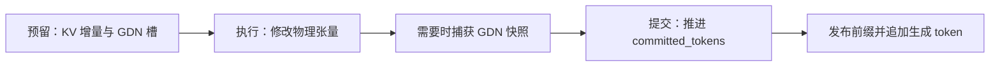

# 调度与混合状态管理

[文档导航](README.md) · 上一章：[模型与运行时](01_qwen35_hybrid_runtime.md) · 下一章：[验证与性能](03_validation_performance.md)

调度器不只决定“谁先运行”。它还必须保证：每个请求下一次计算时，Attention 的 KV 历史和 GDN 的状态对应同一个前缀。下面按成功路径、失败路径和复用路径解释实现。

## 1. 一轮调度与一次前向不同

[Scheduler.schedule()](../nanovllm/engine/scheduler.py)返回 `SchedulerOutput`，分别保存 `decode_chunks` 和 `prefill_chunks`。每个不可变的 `ScheduledChunk` 给出请求及本轮 `[start,end)`；两类工作共享 `max_num_batched_tokens` 和请求数量限制。

调度顺序为：

1. 从运行队列中选择 decode 请求，每个请求计入 1 个 token。
2. 选中的请求放到运行队列尾部，下一轮继续轮转。
3. 没有发生本轮抢占时，把剩余 token 预算和请求名额用于等待队列中的 prefill。
4. prefill 还必须满足 KV 容量和 GDN 槽位约束。

[LLMEngine.step()](../nanovllm/engine/llm_engine.py)随后先执行 decode forward，再执行 prefill forward。**一个调度轮次可以包含两类工作，但当前没有把它们合成一次混合 forward。**

### 预算示例

假设预算为 8 个 token、最多 4 个请求，运行队列有 A/B/C 三个 decode 请求，等待队列有长输入 D：

| 请求 | 本轮工作 | 消费 token | 消费请求名额 |
| --- | --- | ---: | ---: |
| A | decode | 1 | 1 |
| B | decode | 1 | 1 |
| C | decode | 1 | 1 |
| D | prefill chunk | 最多 5 | 1 |

即使 D 有数千个输入 token，本轮也只预留并执行能安排的片段。

如果只有 2 个 token 预算、运行队列为 `[A,B,C]`，第一轮选中 A/B 后队列成为 `[C,A,B]`；下一轮优先轮到 C。这个公平性只针对已经进入 decode 队列的请求，不保证等待中的 prefill 不会被持续的 decode 压力延后。

## 2. 分块 prefill 如何保持连续

本轮请求片段使用半开区间：

```text
start = committed_tokens
q_len = min(尚未计算的 token 数, 剩余预算, KV 可容纳的新增 token 数)
end   = start + q_len
执行 token_ids[start:end]
```

KV 只增长到容纳 `end` 所需的块数；GDN 始终沿用该请求的同一槽号。部分 prefill 的请求仍留在等待队列，并且仍然占有资源。

以 40-token 输入、每轮可用预算 16、块容量 16 为例，假设没有命中缓存且资源充足：

| 轮次 | 输入位置 | 成功后 committed | 请求持有 KV 块数 | GDN 槽 | 是否采样 |
| --- | --- | ---: | ---: | --- | --- |
| 1 | `[0,16)` | 16 | 1 | 同一个槽 | 否 |
| 2 | `[16,32)` | 32 | 2 | 同一个槽 | 否 |
| 3 | `[32,40)` | 40 | 3 | 同一个槽 | 是，生成首个 token |
| 4 | 位置 40 的首个生成 token | 41 | 3 | 同一个槽 | 是，生成第二个 token |

第 3 轮后，`num_tokens=41`，`committed_tokens=40`。部分 chunk 不会生成可交给用户的 token；只有所有已知输入都处理完，`ModelRunner._sample_indices()` 才选中该请求采样。

同一请求本轮只安排一个 chunk；调度器继续扫描其他等待请求。暂时缺少资源的请求会轮转到队尾，本轮仍可能安排后续请求。

## 3. 预留、执行、提交是三个阶段



### 预留失败：撤销本次新增资源

`HybridResources.reserve()`记住原有 KV 块数，以及 GDN 槽是否为本次新分配。如果后续分配失败：

- 只释放新增加的 KV 尾部；
- 只释放本次新拿到的 GDN 槽；
- 保留先前已经提交的历史。

这时模型尚未执行，可以保留原来的状态。

### 执行成功：推进一个共同边界

`postprocess()`先检查整个批次的采样结果、快照及计划边界，然后推进：

```text
committed_tokens = ScheduledChunk.end
```

若需要发布前缀，先发布该边界的条目，再追加本次采样得到的 token。因为新生成的 token 尚未执行，它不属于刚提交的 KV/GDN 前缀。

## 4. 抢占时为什么必须同时处理两种状态

decode 缺少 KV 容量时，调度器先尝试淘汰前缀缓存条目。若仍不足，就抢占运行队列尾部的请求；没有其他请求可抢占时，当前请求也可能被撤回。本轮发生抢占后，不再安排新的 prefill。

`preempt()`最终进入 `_reset_to_waiting()`：

```text
从原队列移除请求
  → 清空待恢复快照
  → 释放该请求的 KV 引用
  → 释放 GDN 槽所有权
  → committed_tokens = 0
  → 放回等待队列尾部
```

`token_ids` 保留，包括已经生成的 token。重新调度时，可以恢复可用的联合前缀，然后重算剩余已知 token；没有命中则从头重算。

GDN 循环更新通常不能仅凭当前矩阵恢复任意更早状态，因此不能“KV 从头开始，GDN 继续沿用旧进度”。当前抢占以重算为基准，没有请求状态换出到 CPU 后无损续算的专用路径。

## 5. 执行失败与预留失败的区别

模型前向或快照捕获抛出异常时，物理 KV/GDN 张量可能已经更新了一部分。丢弃本轮计划也不能撤销这些写入。

[LLMEngine._run_batch()](../nanovllm/engine/llm_engine.py)在这类异常中调用 `recover_failed_step()`，联合释放可能已被修改的请求历史，重置边界，并将异常继续抛给调用方。

如果 decode 失败，同一轮已经预留但尚未执行的 prefill 也会被撤回。如果 decode 已成功提交、随后 prefill 失败，先前成功的 decode 不会被整体回滚。由此可见，当前恢复单位是执行批次，整轮调度不是一个跨两次 forward 的数据库式事务。

“可恢复”表示状态重新具备重算条件，**不表示 `generate()` 会自动吞掉异常并重试**。已发布缓存条目拥有独立 KV 引用与不再修改的快照，可以继续存在。这里描述的是前向/快照异常的恢复路径，不能推导出所有后处理异常都具有通用事务回滚。

## 6. 联合前缀缓存保存什么

[JointPrefixEntry](../nanovllm/engine/prefix_cache.py)包含：

| 内容 | 为什么需要 |
| --- | --- |
| 精确 `token_ids` 元组 | 确认输入前缀一致，不能仅比较文本看起来是否相同 |
| `block_ids` | 共享 Full Attention 的物理 KV 块 |
| `num_tokens` | 给出共同的历史边界 |
| `GDNStateSnapshot` | 保存同一边界处所有 GDN 层的卷积和循环状态 |

[PrefixRuntime](../nanovllm/engine/prefix_runtime.py)负责前缀命中、快照条件、发布和淘汰；[HybridResources](../nanovllm/engine/hybrid_resources.py)负责请求的联合预留、恢复和释放。调度器决定何时调用它们，并把快照需求写入本轮计划。

### 什么时候能发布

自动快照来自 prefill 成功执行后的边界，并且必须满足：

- 前缀缓存已启用，请求有状态槽且本轮安排了 token；
- 边界大于零且不超过原始 prompt 长度；
- **本轮结束位置恰好是完整 KV 块边界**；
- 该精确 token 前缀尚未存在。

例如块容量为 16，某轮从位置 0 一次执行到 20，虽然 KV 中已有一个完整块，但 GDN 此刻表示 20-token 历史，代码不会反推位置 16 的状态，因此不会自动发布 16-token 快照。若先执行到 16，再继续剩余 4 个，就有机会发布前缀。

整块边界还能避免共享一个将被继续写入的半满块；新请求续写时分配后续块，不会覆盖共享前缀。

### 怎样查找和恢复

缓存用 `OrderedDict` 保存有上限的 LRU 条目。查找会扫描已有条目，比较精确 token 前缀，选择最长命中，并更新其最近使用顺序。

```text
新请求或被重置的请求
  → 查找最长可用前缀
  → 分配独占 GDN 槽
  → 增加共享 KV 块的引用计数
  → committed_tokens = 命中前缀长度
  → pending_state_snapshot = 命中的 GDN 快照
  → ModelRunner 在下一次 prefill 前恢复设备状态
  → 执行未缓存的后缀
```

**至少留下一个已知 token 重算。** 查找上限为 `num_tokens - 1`，因为缓存没有保存下一 token 的 logits。即使整个输入正好与某个缓存条目一致，也不能跳过全部前向后凭空采样。

## 7. 引用计数怎样保证共享 KV 不被提前释放

设块 X 最初由请求 A 持有：

| 操作 | X 的引用数 |
| --- | ---: |
| A 分配 X | 1 |
| 缓存发布包含 X 的前缀 | 2 |
| A 完成并释放自己的引用 | 1 |
| B 命中并附加 X | 2 |
| 缓存淘汰该条目 | 1 |
| B 完成 | 0，块可重新分配 |

缓存淘汰不一定立即产生空闲 KV 块，因为请求或其他缓存条目可能仍在引用它。活动 GDN 槽则不采用这样的共享引用机制：每个槽只属于一个请求，缓存保存的是它的独立快照。

## 8. BF16 快照的精度与空间代价

[GDNStatePool](../nanovllm/layers/gdn_state.py)将活动状态复制到 CPU，并把卷积状态和循环矩阵都保存为 BF16。恢复时，再复制回活动缓冲区对应的 dtype。

```text
运行中：卷积 = 模型 dtype，循环矩阵 = FP32
快照中：卷积 = BF16 CPU，循环矩阵 = BF16 CPU
恢复后：卷积 = 模型 dtype，循环矩阵 = FP32，但已发生过 BF16 舍入
```

恢复成 FP32 不会找回已经舍弃的精度，必须验证恢复后的生成序列。条目上限约束的是缓存项数，不是精确字节数；缓存还会持有 GPU KV 引用并产生设备到主机的快照传输。

## 9. 阅读代码时应检查的约束

- 同一执行批次不能有两个请求使用同一 GDN 槽。
- 有已提交历史时，必须能找到对应 KV 与 GDN 资源或待恢复快照。
- decode 前满足 `committed_tokens == len(seq) - 1`。
- 前缀快照的 token 边界必须等于共享 KV 前缀边界。
- 预留失败只撤销增量；前向失败会丢弃可能被写坏的请求历史。
- 完成、抢占、缓存发布和缓存淘汰各自只释放或增加自己拥有的引用。

对应测试见 [test_scheduler.py](../tests/unit/test_scheduler.py)、[test_prefix_cache.py](../tests/unit/test_prefix_cache.py)、[test_state_manager.py](../tests/unit/test_state_manager.py) 和 [test_llm_engine.py](../tests/unit/test_llm_engine.py)。
