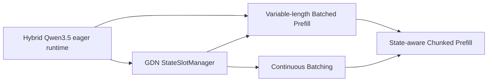
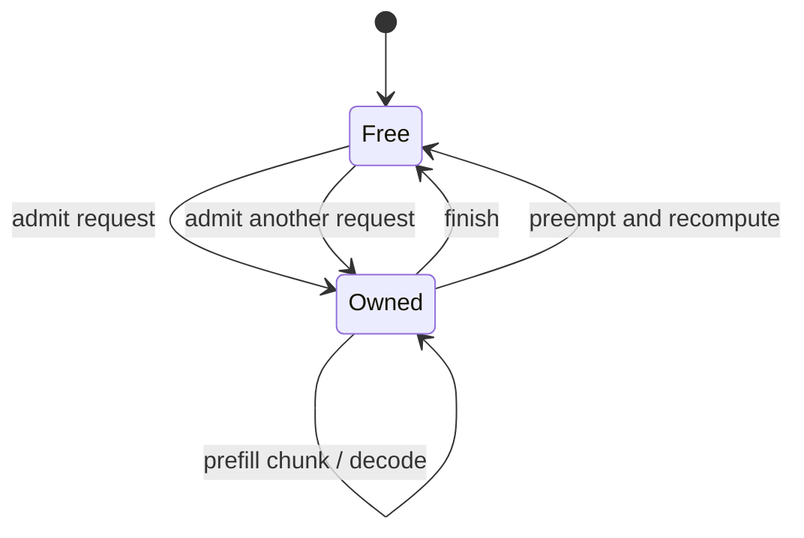
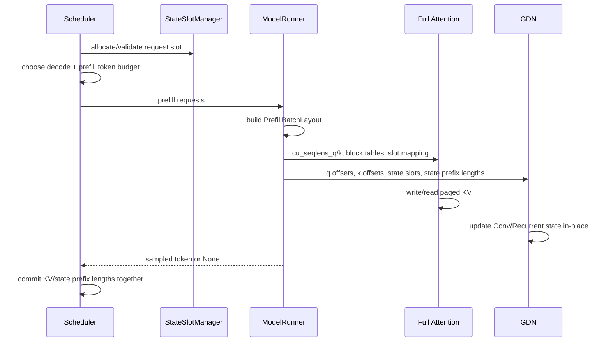

# Qwen3.5-MoE Batching and Recurrent-State Runtime

This note documents three runtime stages built on top of the Qwen3.5-MoE eager
baseline:

1. variable-length batched prefill;
2. continuous batching with dynamic request-to-state-slot ownership;
3. state-aware chunked prefill across scheduler steps.

The implementation stays intentionally narrow: one Qwen3.5-MoE text runtime,
single GPU, eager execution. The goal is to make the invariants explicit before
introducing fused GDN kernels, CUDA Graph, prefix-state checkpoints, TP or EP.

---

## 1. Dependency order



The order matters. Chunked prefill becomes unsafe if the runtime can pack
tokens but cannot prove which recurrent state belongs to each request.

---

## 2. The core invariant

For every admitted request, the committed history has two physical forms:

```text
Full Attention history = paged KV prefix
GDN history            = Conv state + recurrent matrix
```

The runtime now tracks the logical length of both:

```text
seq.num_cached_tokens
seq.num_state_tokens
```

At scheduler boundaries they must be equal:

```text
num_cached_tokens == num_state_tokens
```

A model step may mutate physical GPU caches before postprocess commits the new
length, but the next scheduler step is not allowed to observe a mismatch.

This additional counter is intentionally redundant. Its value is that an
incorrect chunk/state pairing now fails loudly instead of silently producing
numerically inconsistent history.

---

## 3. Variable-length batched prefill

### 3.1 Why packed prefill needs more than concatenated tokens

Suppose two requests contribute different chunks:

```text
A: committed prefix = 2, current chunk = 3
B: committed prefix = 0, current chunk = 2
```

The packed token tensor contains only current query tokens:

```text
packed_q = [A2 A3 A4 | B0 B1]
q_offsets = [0, 3, 5]
```

Full Attention needs the total visible key lengths:

```text
A key length = 2 + 3 = 5
B key length = 0 + 2 = 2

k_offsets = [0, 5, 7]
```

GDN does not read paged KV, but it needs the same request segmentation:

```text
state_slots       = [slot_A, slot_B]
state_prefix_lens = [2, 0]
```

The important rule is positional alignment:

```text
request i
  <-> q_offsets[i:i+2]
  <-> k_offsets[i:i+2]
  <-> state_slots[i]
  <-> state_prefix_lens[i]
  <-> block_tables[i]
```

The implementation represents this contract with `PrefillBatchLayout`.
It is CPU metadata and can be unit-tested without CUDA.

### 3.2 Why Q and K offsets are different

For fresh prefill:

```text
q_len == k_len
```

For a later chunk:

```text
q_len = current chunk length
k_len = committed prefix + current chunk
```

Therefore:

```text
prefix_len = k_len - q_len
```

GDN checks that this derived prefix length equals
`state_prefix_lens[i]`. That couples the packed attention view and recurrent
state view of the same request.

### 3.3 Slot mapping

`slot_mapping` still contains one physical KV write position per packed query
token. It is generated from each request's block table and current
`[start, end)` range.

The layout builder validates:

- every scheduled chunk is non-empty;
- the chunk does not exceed the request token count;
- KV/state committed prefix lengths match;
- state slots are unique inside one active batch;
- the block table covers the chunk;
- slot mapping length equals packed token count when persistent caches exist.

Warmup remains supported as the only unallocated path: no KV blocks, state slot
`-1`, zero committed prefix.

---

## 4. Continuous batching

### 4.1 The earlier weakness

A set of used slot ids proves only that a physical slot is occupied. It does not
prove which request owns it.

The failure mode is state aliasing:

```text
request A -> slot 0
request B -> accidentally also references slot 0
```

Both requests would mutate the same Conv/Recurrent state.

### 4.2 Explicit ownership

`StateSlotManager` keeps:

```text
free_slot_ids
slot_owners[slot] -> seq_id | None
```

`slot_owners` is the single occupancy source of truth. A request with an
existing slot is valid only when:

```text
slot_owners[slot] == seq.seq_id
```

Allocation, reuse and release therefore form a small state machine:



### 4.3 Dynamic reuse

Continuous batching does not require the same request to keep a particular
physical slot forever. It requires ownership to be stable while the request is
active.

Example:

```text
step N:
  A -> slot 0
  B -> slot 1

A finishes:
  slot 0 -> free

step N+1:
  B -> slot 1
  C -> slot 0
```

The GDN layer clears slot 0 when C starts with state prefix length zero, so stale
physical values from A cannot leak into C.

### 4.4 Decode and prefill in the same scheduler step

The scheduler remains decode-first:

```text
token budget
  -> active decode requests
  -> remaining budget for waiting prefill requests
```

Decode and prefill are executed as separate model batches, but they share the
same scheduler ownership table. New requests are admitted only when both KV
capacity for the current scheduled range and a recurrent-state slot are
available. KV blocks grow incrementally with committed/scheduled progress; the
unscheduled tail of a long prompt does not consume blocks.

---

## 5. State-aware chunked prefill

A long prompt may span multiple scheduler steps:

```text
request A, prompt length 8, token budget 3

step 1: [0, 3) -> committed state length 3
step 2: [3, 6) -> committed state length 6
step 3: [6, 8) -> committed state length 8
```

The state slot is not released between these chunks. The KV block table also
grows only when a new chunk crosses a block boundary, so chunked prefill is
state-aware and resource-aware rather than merely splitting compute.

For every later chunk:

```text
packed prefix length
    = k_len - q_len
    = seq.num_state_tokens
    = seq.num_cached_tokens
```

GDN keeps the existing physical state only when that equality holds.

### 5.1 Final chunk can join a new request

The scheduler can produce a mixed prefill batch when a partially prefetched
request finishes its remaining chunk and token budget remains:

```text
A: prefix 6 + final chunk 2
B: fresh chunk 1

packed batch:
  q lengths     [2, 1]
  state prefixes[6, 0]
  state slots   [slot_A, slot_B]
```

This is the important integration case: variable-length packing, dynamic slot
ownership and cross-step recurrent continuity all meet in one batch.

### 5.2 Preemption policy

Stages 7-9 extend this baseline with explicit hybrid preemption and joint prefix
restore. A preempted request still releases its request-owned KV blocks and GDN
slot together, but on re-admission it may attach a previously published
full-block KV prefix and restore the matching GDN snapshot before replaying the
remaining history.

If no valid joint prefix exists, replay falls back to token history from zero.
A model-step exception before logical commit still invalidates both request
histories together.

See `qwen35_scheduler_preemption_prefix_design.md` for the current policy.

---

## 6. Runtime data flow



---

## 7. Why these abstractions, and no more

### Keep `PrefillBatchLayout`

It represents a concrete boundary between CPU scheduling metadata and GPU model
execution. It also gives a CUDA-free unit-test target for packed sequence
correctness.

### Keep `StateSlotManager`

KV blocks and recurrent state have different allocation units and lifetimes.
The owner map expresses a real resource invariant.

### Do not add a generic cache-group hierarchy

The project currently has exactly two history resources: paged KV and GDN
state. A generalized cache-group/plugin hierarchy would add indirection without
solving a current requirement.

### Do not add a HybridModelRunner subclass

Full Attention and GDN execute inside the same decoder loop. The runtime
difference is metadata and persistent state ownership, which fits in one runner.

### Keep prefix-state checkpoints narrow

The next stages add one bounded joint prefix cache because KV-only reuse is
incorrect for GDN. The cache keeps exact token prefixes, full-block KV
references and matching host GDN snapshots. It intentionally does not add a
generic cache-group hierarchy or radix tree.

---

## 8. What was learned from larger engines

Current vLLM and SGLang implementations reinforce three useful invariants:

1. recurrent state is a separate fixed-size resource from paged KV;
2. active requests need an explicit mapping to recurrent-state storage;
3. recurrent-model prefix reuse requires state checkpoints in addition to KV.

This project adopts those invariants while avoiding their broader production
machinery: multiple backends, cache groups, distributed state transfer,
quantized checkpoint pools and prefix-cache strategies.

The design rule is:

```text
take the invariant that the model requires,
do not import the framework built for unrelated deployment modes.
```

---

## 9. Tests that matter

### Packed prefill

`tests/test_prefill_batch.py`

Covers:

- heterogeneous fresh sequence lengths;
- mixed fresh + chunked metadata;
- Q/K offsets;
- physical KV slot mapping;
- state-slot ordering;
- warmup without persistent caches;
- duplicate-slot rejection;
- KV/state prefix mismatch rejection.

### State ownership

`tests/test_state_manager.py`

Covers:

- allocate/release/reuse;
- stale slot rejection;
- alias rejection;
- owner transition on reuse;
- rejection of non-zero state progress on a fresh slot.

### Scheduler integration

`tests/test_scheduler.py`

Covers:

- decode-first budgeting;
- variable-length prefill batching;
- state-slot persistence across partial chunks;
- released-slot reuse by a newly admitted request;
- final chunk + fresh request in the same prefill batch;
- preemption release;
- failed-step invalidation and recompute;
- incremental KV growth across prefill chunks;
- KV/state progress divergence rejection.

### GDN numerical continuity

`tests/test_gated_delta_net.py`

Covers:

- full sequence vs chunked recurrence;
- token-by-token decode vs sequential recurrence;
- reused-slot clearing;
- cross-step state preservation;
- variable-length packed requests mapped to different state slots;
- state-prefix mismatch rejection.

---

## 10. Interview framing

A concise explanation:

> Qwen3.5-MoE has two kinds of persistent history: paged KV for full-attention
> layers and fixed-size Conv/Recurrent state for GDN layers. For variable-length
> prefill I pack only current query tokens, while keeping Q offsets, total-key
> offsets, state slots and recurrent-prefix lengths aligned by request. For
> continuous batching I added explicit slot ownership so a recycled physical
> state slot cannot alias two active requests. For chunked prefill I track the
> committed recurrent prefix length separately and require it to match the KV
> prefix and the packed K-Q length difference before reusing state across
> scheduler steps.

Likely follow-up questions:

**Why keep both `num_cached_tokens` and `num_state_tokens` if they should be
equal?**

Because equality is the correctness invariant. A separate counter turns an
implicit assumption into something the scheduler and GDN can validate.

**Why not copy vLLM/SGLang state-cache abstractions?**

Their abstractions cover more backends, prefix checkpoints, distributed
execution and memory policies. This runtime needs the ownership invariant, not
the entire product surface.

**Why is a state slot stable across chunks?**

GDN recurrence is sequential. Chunk N+1 must start from the exact Conv/Recurrent
state produced by chunk N.

**Why can a finished request's slot be reused immediately?**

The slot has no identity of its own. Ownership is request-scoped, and a fresh
request with prefix length zero clears stale physical state before use.

**What would the next optimization stage be?**

After the joint prefix cache, evaluate BF16 GDN snapshots as a separate
numerical/memory optimization, then replace the eager token-scan GDN with a
chunked/fused kernel while preserving the same ownership and prefix invariants.
