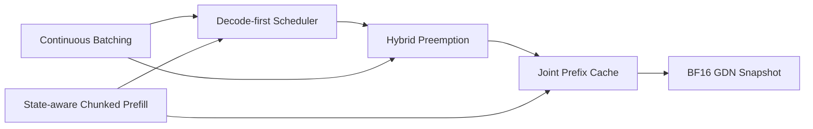

# Qwen3.5-MoE Scheduler, Hybrid Preemption and Joint Prefix Cache

This note documents stages 7-9 of the specialized Qwen3.5-MoE eager runtime:

1. Decode-first Scheduler
2. Hybrid Preemption
3. Joint Prefix Cache

It continues the batching/state work in
`qwen35_batching_state_design.md`. The implementation remains intentionally
small: one Qwen3.5-MoE text runtime, one GPU, eager execution, paged KV for
Full Attention, and explicit Conv/Recurrent state slots for Gated DeltaNet.

The design target is not "copy a production engine". The target is to expose
the invariants that a hybrid model requires, with enough policy to demonstrate
real scheduling/cache interactions.

---

## 1. Dependency order



The stages are coupled by one invariant:

```text
committed Full-Attention history length
==
committed GDN history length
```

A request may temporarily have a scheduled-but-not-yet-committed suffix during
one forward pass. At every scheduler boundary, however:

```text
seq.num_cached_tokens == seq.num_state_tokens
```

---

## 2. Stage 7 — Decode-first Scheduler

### 2.1 Why decode goes first

Decode has two properties that make latency sensitive scheduling reasonable:

- each active request usually consumes one token of compute per scheduler step;
- delaying one decode request adds directly to inter-token latency.

Long prefills can consume the entire token budget in one step. Therefore the
scheduler allocates the shared budget in this order:

```text
step token budget
    -> running decode requests, one token each
    -> remaining tokens to waiting/chunked prefill
```

The scheduler still executes decode and prefill as separate model batches.
Trying to fuse both paths into one generalized batch would add metadata
branches to the small eager runner without changing the scheduling invariant.

### 2.2 Token budget

For one scheduler step:

```text
decode_tokens  = number of selected running requests
prefill_tokens = sum(current prefill chunk lengths)

decode_tokens + prefill_tokens <= max_num_batched_tokens
```

The sequence-count limit is shared as well:

```text
len(decode_batch) + len(prefill_batch) <= max_num_seqs
```

Admission of a new prefill request additionally requires:

```text
KV capacity for this scheduled range
AND
one free GDN state slot
```

The prompt tail that is not scheduled does not reserve KV blocks.

### 2.3 Decode fairness bug and fix

A subtle bug appears when:

```text
active decode requests > max_num_batched_tokens
```

If the scheduler always puts selected decode requests back at the front of the
running queue, the same requests are repeatedly chosen and the unscheduled tail
can starve.

The fix is round-robin rotation:

```text
before: [A B C], budget=2
step 1: schedule A B
after:  [C A B]

step 2: schedule C A
after:  [B C A]
```

This is intentionally simpler than introducing priorities, virtual runtime or
a policy object.

### 2.4 What was learned from vLLM

Current vLLM V1 also reasons about scheduling through a fixed token budget and
allows prompt/output work to compete inside that budget. This project keeps the
same useful invariant while retaining explicit decode and prefill batches,
because the Qwen3.5 eager runner already has two clear metadata paths.

References:

- https://docs.vllm.ai/en/latest/api/vllm/v1/core/sched/scheduler/
- https://docs.vllm.ai/en/latest/usage/v1_guide/

---

## 3. Stage 8 — Hybrid Preemption

### 3.1 What makes preemption hybrid

For this model, a running request owns two forms of history:

```text
Full Attention -> paged KV blocks
Gated DeltaNet -> one active Conv/Recurrent state slot
```

Preempting only one side is invalid.

For example:

```text
release KV
keep GDN state
=> recurrent state represents tokens that Full Attention can no longer see
```

or:

```text
keep KV
release GDN state
=> Full Attention sees history that GDN forgot
```

Therefore preemption is an atomic logical transition:

```text
RUNNING
  -> release request KV references
  -> release active GDN slot
  -> reset both committed lengths
  -> WAITING
```

Both counters return to zero together.

### 3.2 Why this project does not implement KV swap

A more general engine can swap KV/state to host memory or maintain multiple
preemption modes. That would require:

- asynchronous device/host transfer;
- transfer completion events;
- separate memory budgets;
- restore ordering;
- more failure states.

For this single-GPU learning runtime, preemption uses replay:

```text
preempt
  -> jointly invalidate active KV + GDN
  -> return request to waiting
  -> restore a valid joint prefix if one exists
  -> replay the remaining token history
```

This keeps correctness visible. It also matches the practical direction of
modern vLLM V1, where legacy GPU/CPU KV swapping is no longer the central
preemption mechanism.

### 3.3 Cache eviction before live preemption

Prefix-cache entries are idle reusable work. Running requests are live work.

When a decode request needs a new KV block, the scheduler therefore reclaims in
this order:

```text
1. evict least-recently-used joint prefix entries
2. if still necessary, preempt a running request
```

Eviction releases only the cache's block reference. If a running request also
uses that block, its own reference keeps the physical block resident.

### 3.4 Failed forward recovery

A forward can fail after kernels have already mutated KV or GDN tensors.

Logical counters are committed only in `postprocess`, so the safe recovery is:

```text
forward fails before commit
  -> do not trust either physical history
  -> release request KV references
  -> release active GDN slot
  -> reset scheduled progress
  -> replay later
```

A previously published prefix-cache entry remains valid because it has its own
KV references and an immutable host snapshot.

---

## 4. Stage 9 — Joint Prefix Cache

### 4.1 Why KV-only prefix caching is incorrect

For a pure transformer:

```text
shared token prefix -> shared KV prefix
```

For Qwen3.5-MoE hybrid layers:

```text
shared token prefix
  -> matching Full-Attention KV
  AND
  -> matching GDN Conv/Recurrent state
```

A cache hit is valid only if both represent the same prefix boundary.

The cache entry is therefore:

```text
JointPrefixEntry
  token_ids
  num_tokens
  KV block ids
  GDN state snapshot for exactly num_tokens
```

### 4.2 Full-block boundary rule

Shared KV blocks must be immutable.

If two requests shared a partially filled last block, the new request would
write its divergent suffix into the same physical block. Therefore a reusable
prefix ends only on:

```text
num_tokens % kvcache_block_size == 0
```

The GDN snapshot is accepted only when:

```text
snapshot.num_tokens
==
seq.num_cached_tokens
==
seq.num_state_tokens
```

This is the core joint-cache invariant.

### 4.3 Natural alignment only

The scheduler does not force a prefill chunk to end at every block boundary
just to create cache checkpoints.

Instead it publishes a prefix only when the normal scheduled step already ends
at a full-block boundary.

Reason:

- forced splitting increases scheduler/model invocations;
- GDN snapshots are currently large;
- stage 10 will optimize snapshot representation;
- the educational value comes from correct joint ownership, not maximizing hit
  rate at any cost.

This is similar in spirit to vLLM's Mamba `align` mode, which retains selected
scheduler-step/block-aligned recurrent checkpoints rather than blindly storing
every token state.

References:

- https://docs.vllm.ai/en/latest/features/automatic_prefix_caching/
- https://docs.vllm.ai/en/latest/api/vllm/config/cache/

### 4.4 Exact token tuples instead of a block-hash tree

vLLM uses hashed KV blocks, and SGLang uses radix-based prefix structures.
Those are appropriate for large cache populations.

This runtime uses:

```text
small bounded LRU
+
exact token tuple comparison
```

Why:

- no hash collision path;
- no radix/tree mutation logic;
- easy to unit test;
- `max_prefix_cache_entries` keeps lookup bounded;
- sufficient to demonstrate joint KV/GDN prefix reuse.

A hash/radix structure becomes justified only after profiling proves lookup
cost or cache scale is a real problem.

### 4.5 KV ownership

`BlockManager` now keeps a reference count per physical block.

Typical lifecycle:

```text
request A allocates block 7
refcount(7) = 1

publish cached prefix
refcount(7) = 2
  - A reference
  - cache reference

A finishes
refcount(7) = 1
  - cache still owns it

request B hits prefix
refcount(7) = 2
  - cache reference
  - B reference

cache entry evicted
refcount(7) = 1
  - B continues safely

B finishes
refcount(7) = 0
  -> block returns to free list
```

This is the minimum ownership machinery required for safe cross-request reuse.

### 4.6 GDN snapshot ownership

Active recurrent state remains in the per-layer GPU state pools addressed by
`state_slot`.

Cached recurrent state is different:

```text
active state
  -> mutable
  -> GPU slot
  -> one running request owns it

cached snapshot
  -> immutable checkpoint
  -> host tensor copies
  -> prefix-cache entry owns it
```

On a hit:

```text
1. allocate a fresh active state slot
2. attach shared KV block references
3. set logical KV/GDN prefix lengths to the same boundary
4. mark the cached GDN snapshot as pending
5. immediately before forward, copy snapshot into the active slot
6. execute only the uncached suffix
```

Keeping cached and active state separate avoids aliasing: two requests may reuse
one cached checkpoint but must not mutate one shared recurrent matrix.

SGLang uses the same important separation at a larger scale: cached Mamba/GDN
checkpoints are distinct from active state slots and are restored into active
storage on a cache hit.

Reference:

- https://github.com/sgl-project/sglang/blob/main/python/sglang/srt/mem_cache/mamba_checkpoint_pool.py

### 4.7 Snapshot timing

A snapshot is captured only after the model forward that produced the target
state has completed.

The engine then passes that snapshot into scheduler postprocessing. The
scheduler advances the logical KV/GDN counters and publishes the cache entry at
the same committed boundary before a finishing request releases its own
resources.

This ordering avoids publishing:

```text
new GDN state + old logical KV length
```

or:

```text
new KV data + stale recurrent snapshot
```

SGLang has encountered real snapshot-ordering races around chunked prefill and
overlap scheduling; this eager runtime has no overlap stream, but the same
ownership rule is worth making explicit.

Reference:

- https://github.com/sgl-project/sglang/issues/24221

---

## 5. Why the implementation remains narrow

### Kept abstractions

`BlockManager`

Because KV pages have token/block lifetime and now shared-reference ownership.

`StateSlotManager`

Because active recurrent state has request/slot lifetime.

`JointPrefixCache`

Because one reusable prefix must own both KV references and a matching recurrent
checkpoint. This is a new lifetime that did not exist before stage 9.

### Deliberately not added

No generic cache-group coordinator.

There are exactly two relevant history resources in this project. A multi-group
backend hierarchy would duplicate production-engine architecture without a
second model/backend requirement.

No radix tree.

The bounded exact-match LRU demonstrates the invariant with much less code.

No forced checkpoint interval.

The scheduler does not change chunk sizes only to manufacture more cache
entries.

No compressed snapshot format yet.

The recurrent matrix remains FP32 in cached snapshots. Stage 10 can measure the
accuracy/memory trade-off of BF16 snapshots separately.

No async snapshot stream.

Host snapshots are synchronous. This is slower, but avoids introducing stream
ordering before the correctness path is proven.

---

## 6. Important invariants

### Scheduler boundary

```text
num_cached_tokens == num_state_tokens
```

### Prefix hit

```text
cached token prefix matches exactly
cached length < request token count
cached length is a full KV block boundary
KV blocks are still referenced
GDN snapshot length == cached length
```

### Active state ownership

```text
state_slot >= 0
=> StateSlotManager.owner_of(state_slot) == seq_id
```

### Shared KV ownership

```text
block_refcount > 0
=> physical block is not in the free list
```

### Cache publication

```text
snapshot boundary
==
committed KV boundary
==
committed GDN boundary
```

---

## 7. Failure modes worth discussing in an interview

### KV hit without GDN snapshot

Result: Full Attention resumes from the prefix while GDN starts from zero or
stale state.

The model has internally inconsistent history.

### GDN snapshot restored to the old owner's active slot

Result: two requests can mutate one recurrent state.

The fix is copy-on-restore into a newly owned active slot.

### Sharing a partial KV block

Result: divergent suffix writes corrupt another request's cached prefix.

The fix is full-block cache boundaries.

### Snapshot captured before forward completion

Result: prefix metadata can point at partially written recurrent state.

The eager path captures only after `ModelRunner.run` returns.

### Prefix cache keeps raw block ids without references

Result: a block can be returned to the free list and reused while a cache entry
still points to it.

The fix is per-block reference counting.

### Decode-first without queue rotation

Result: when the token budget is smaller than active decode concurrency, the
same requests can monopolize every step.

The fix is round-robin rotation of selected decode requests.

---

## 8. Test coverage

`tests/test_scheduler.py`

- decode uses budget before prefill;
- decode round-robin fairness under a smaller token budget;
- hybrid preemption releases KV and GDN together;
- failed-step recovery resets both histories;
- joint prefix publication keeps an extra KV block reference;
- request finish drops only its own KV reference;
- a later request restores matching KV/GDN prefix metadata together.

`tests/test_prefix_cache.py`

- longest exact prefix match;
- max reusable length leaves at least one token to execute;
- bounded LRU eviction returns entries for resource release.

`tests/test_gated_delta_net.py`

- state-slot snapshot/restore round trip;
- existing chunk/decode continuity coverage;
- prefix-length mismatch rejection.

---

## 9. Interview summary

A compact explanation:

> I changed the scheduler to spend a fixed token budget on decode first and use
> the remainder for chunked prefill, then fixed fairness by rotating scheduled
> decode requests. For preemption I treat paged KV and GDN state as one logical
> history: both are released together and the request re-enters waiting. To make
> prefix reuse safe for the hybrid model, I added a joint cache entry that pins
> full KV blocks with reference counts and stores the GDN snapshot from the exact
> same token boundary. A hit allocates a fresh active recurrent slot, attaches
> the shared KV blocks, restores the snapshot, and computes only the suffix. I
> borrowed the alignment and active-vs-cached-state invariants from vLLM/SGLang,
> but kept a bounded exact-match LRU instead of copying their cache-group/radix
> architectures.

Likely follow-up:

**Why must a cache hit leave at least one token to execute?**

The runtime caches KV and recurrent state, not the prompt logits. If every input
token were skipped, there would be no hidden state from which to sample the next
token.

**Why host snapshots?**

They do not consume the GPU state-slot pool and make cached state ownership
obvious. They are intentionally synchronous and uncompressed at this stage.

**Why not cache every recurrent boundary?**

State snapshots are large and forced chunking would add forwards. This stage
proves correctness first. Snapshot density and compression are separate
optimization questions.

**Why is stage 10 separate?**

Changing the recurrent snapshot from FP32 to BF16 changes numerical behavior.
It should be benchmarked and validated independently from cache ownership logic.
